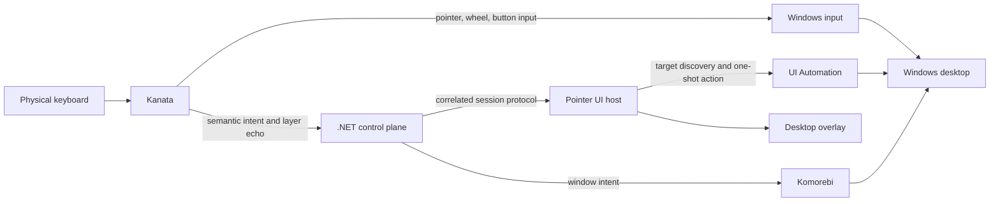

# Architecture

Desknav provides keyboard-first Windows desktop navigation. It keeps every
input path, state transition, and recovery action small enough to understand
and test without loading the whole desktop stack into memory.

This document defines the system shape. [BACKLOG.md](BACKLOG.md) records
implementation status and order.

## System goals

Desknav gives direct physical actions a short, low-latency path and gives
semantic actions an explicit lifetime and outcome. Each mutable state has one
owner. External systems are observed and reconciled rather than assumed to be
in sync.

## Topology

Dependencies point from adapters toward pure state and policy. The policy does
not depend on Windows, UI Automation, pipes, or process APIs.

## Ownership

| Component | Owns | Does not own |
|---|---|---|
| Kanata | The only keyboard hook, keyboard layers, continuous pointer movement, wheel input, and physical button taps | Semantic routing, overlays, or provider sessions |
| .NET control plane | Complete semantic intents, focus-context routing, session coordination, outcomes, and restoration | Continuous pointer-motion state or desktop overlays |
| Pointer UI host | Overlays, read-only target discovery, and explicitly requested one-shot actions | Global keyboard capture or provider selection |
| Komorebi | Window-manager effects and its observable state | Desknav session lifetime or fallback policy |
| UI Automation | The observable accessibility tree and requested control actions | Desknav session identity or retry policy |

One local Akka.NET actor owns the Pointer UI session. The coordinator has no
cluster, persistence, sharding, distributed pub/sub, stream, or child-actor
topology. Another actor earns a place only when it owns an independent
lifetime that the coordinator cannot represent safely.

Kanata, Akka.NET, Komorebi, and UI Automation remain visible at their native
APIs. An adapter exists only where Desknav defends a process, operating-system,
or protocol boundary; it does not rename a library behind a pass-through API.

## Input paths

### Continuous physical actions

Physical key, pointer, wheel, and button input flows through Kanata directly to
Windows. The control plane does not mirror, replay, or maintain a second copy
of continuous pointer state.

### Semantic actions

A semantic action follows one coordinated path:

1. Kanata captures a complete intent without emitting command characters to
   the focused application.
2. The control plane accepts the intent and snapshots the relevant focus
   context.
3. The coordinator resolves one eligible provider.
4. The provider acknowledges a correlated session for that context.
5. A direct action commits, or a target-selection action presents choices and
   accepts one correlated selection.
6. The provider validates the acknowledged context and performs the action as
   one commit operation.
7. The coordinator makes the provider quiescent and reconciles Kanata to its
   base layer before returning ordinary keyboard input.

A provider either performs the requested semantic result or returns a distinct
refusal. The coordinator does not silently fall through to another provider
whose boundary behavior differs.

## Session state

The session owner moves through these phases:

| Phase | Meaning |
|---|---|
| Idle | No semantic session owns keyboard input |
| Resolving | An intent and focus snapshot exist while one provider is selected |
| Active | A provider has acknowledged the context and may present targets |
| Committing | One accepted action is being validated and performed |
| Restoring | The provider is quiescent and the Kanata base layer is being reconciled |

A direct action can move from resolving to committing without an active target
selection phase.

Cancellation wins before the atomic transition to committing. The commit wins
after that transition, including when the action itself changes focus. Focus
change, timeout, rejection, or user cancellation before commit produces a
refusal and no action. A timeout after commit begins produces **outcome
unknown**, because the external action may have occurred. Desknav never retries
an outcome-unknown action automatically.

The coordinator returns keyboard ownership only after the provider is
quiescent. Cancellation and commit each have an explicit finite deadline in
coordinator policy. When either deadline expires, coordinator-controlled
revocation has its own explicit finite deadline. These deadlines are
configuration values, and behavior tests assert their exact boundaries. A
provider without bounded revocation is not eligible for the protocol.

## Identity model

The protocol keeps independent lifetimes independent:

| Identity | Scope |
|---|---|
| Intent generation | One accepted user intent and the callbacks it permits |
| Connection epoch | One transport connection lifetime |
| Request sequence | One request within a connection epoch |
| Host session token | One Pointer UI host process lifetime |
| Restoration operation ID | One idempotent request to reconcile Kanata state |

No identity substitutes for another. A request sequence is meaningful only
with its connection epoch. A host session token prevents results from a
replaced Pointer UI process from joining the current session. An intent
generation invalidates late work from an older user command. A restoration
operation ID allows the same reconciliation request to repeat without creating
a second logical restoration.

Pending work is bounded. Every timeout, response, disconnect, selection, and
completion carries enough identity to reject stale or unrelated messages.

## Failure and recovery

Expected pipe failures, timeouts, rejections, disconnects, and provider
revocations are coordinator messages. They drive explicit state transitions
and outcomes.

Unexpected actor failure stops the application. Restarting an actor can replay
an ambiguous one-shot action, so supervision does not resume the coordinator
after an unexpected failure.

Base restoration is idempotent reconciliation. Completion requires a Kanata
layer echo for the requested state; writing a command is not confirmation.
External effects may repeat during reconciliation, but the logical restoration
operation remains the same.

Komorebi, UI Automation, and Pointer UI process state are external observations.
Desknav re-reads them after disconnect, restart, or contradictory events rather
than extending an invalid in-memory assumption.

## Verification boundaries

Pure behavior tests cover state transitions, identity correlation, reordered
events, timeout boundaries, cancellation, and recovery policy. Kanata simulator
tests execute the production keymap and assert its emitted input behavior.
Protocol integration tests exercise real process and transport boundaries with
controlled external adapters.

Live desktop, hardware-input, cursor, UI Automation, process-restart, and
visual-overlay acceptance runs only in the dedicated Windows VM. These checks
prove effects that a simulator or unit test cannot observe.
