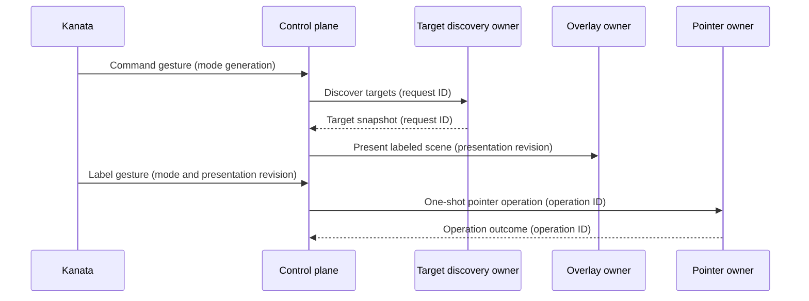

# Architecture

Desknav provides keyboard-first Windows desktop navigation. It keeps each
input path, state transition, and recovery action small enough to understand
and test without loading the whole desktop stack into memory.

This document defines the durable system shape. See [BACKLOG.md](BACKLOG.md)
for implementation work.

## Values

- **Immediacy:** Desktop navigation feels direct.
- **Comprehensibility:** Each path is understandable in isolation.
- **Predictability:** An action has one meaning and an explicit
  outcome.
- **Recoverability:** Handled failures return control without guessing whether
  an external action occurred; unexpected owner failure stops the
  application.

## Principles

### Direct physical input stays local

A physical gesture whose Windows effect is fully determined by the gesture
takes a direct path through Kanata. Held pointer movement, wheel input, and
physical button taps do not wait for control-plane routing.

### Gesture recognition and command meaning have separate owners

Kanata decides which physical gesture occurred, including tap, hold,
double-tap, chord, and layer behavior. While command input is delegated, it
forwards the recognized gesture to the control plane. The control plane
decides what that gesture means in the current navigation and desktop
context.

### Workflows and boundaries each have one owner

One control-plane coordinator owns the logical navigation workflow. The
target-discovery, overlay, pointer, keyboard-mode, and Komorebi boundaries
each have one owner.

When Kanata is in passthrough, control-plane and boundary work never delays
ordinary keyboard input. Unfinished work may delay only a later operation
that conflicts on the same boundary. A boundary owner may cancel, overlap,
queue, or fence its own work; it does not infer which workflow supersedes
another.

### Facts fan out and commands have one recipient

A committed state change may be published when several components
intentionally react to the same fact. A request to perform work is directed
to the one owner of that boundary. Publishing a fact does not transfer
workflow ownership to its subscribers.

### External state is reconciled

Komorebi, UI Automation, Kanata, and the Windows desktop remain authoritative
for their observable state. Desknav reads that state after failures, restarts,
and contradictory events instead of extending an invalid in-memory
assumption.

Desired state carries a newer-wins revision. Boundary owners serialize or
coalesce their effects and reconcile after completion so an older operation
cannot define the current state after a newer one. A newer user mode
supersedes an older keyboard-mode request.

### Outcomes describe knowledge, not permanent desktop truth

Target discovery and target positions are point-in-time observations. A
successful one-shot pointer result means the executor reported success for
the requested Windows effect; it does not mean the pointer or target remains
there afterward.

### Policy is pure and effects stay at the boundary

State transitions and routing policy do not depend on Windows, UI Automation,
pipes, or process APIs. Adapters perform effects and report observations to
the policy that decides what they mean. Integration code uses native APIs
directly; an adapter exists only to isolate a process or operating-system
boundary from policy.

## Components

### Kanata

Kanata is the only keyboard hook. It owns keyboard layers, continuous pointer
movement, wheel input, physical button taps, and physical gesture timing.
During command input it stamps forwarded gestures with the command-mode
generation in which they were captured and reports its actual mode.

### Control plane

The control plane owns focus-context routing, navigation workflow state,
outcomes, and desired external state. One coordinator serializes workflow
decisions. It rejects obsolete input and results before they can affect the
current workflow.

### Desknav UI

Desknav UI hosts presentation and one-shot pointer boundaries. Its overlay
owner atomically replaces older presentation with the current labeled scene.
Its pointer owner serializes explicitly requested point or coordinate-
activation operations. Neither boundary captures the keyboard or owns the
navigation workflow.

### Komorebi

Komorebi is an external window manager. Desknav requests defined window
effects and reconciles Komorebi's observable state.

### UI Automation

UI Automation is an external Windows interface for observing and acting on
accessible desktop elements. The target-discovery owner schedules and cancels
UIA work, reports snapshots with their request identity, and never sends
discovery results directly to presentation.

## Interaction paths

### Continuous physical input

Physical movement, wheel, and button input flows from the keyboard through
Kanata to Windows. Its lifetime is the physical key state.

### Target-selection workflow

The coordinator directs boundary work from its current workflow state.

Escape changes the coordinator state immediately and explicitly cancels
obsolete work. When a new request supersedes an old one, the coordinator sends
the cancellation before the new request without waiting for cancellation to
finish. Late results retain their request identity and cannot produce current
presentation or advance a later workflow.

After the overlay confirms a presentation revision, label gestures are
captured with that revision. The control plane accepts a label only when its
presentation revision matches the current target map. A gesture captured for
a stale scene cannot select from a newer one.

Overlay, Komorebi, and other cleanup follow command-mode exit independently.
A later workflow may begin while old cleanup remains in flight; boundary
owners keep the newer desired state authoritative.

### Identity and ordering

Each protocol owns typed identities for its lifetime and ordering. Workflow
generations, request and operation identities, desired-state revisions, and
process and connection lifetimes are not interchangeable. Each logical state
has one writer, and each boundary rejects stale work using its protocol's
identities.

## Failure and recovery

Expected timeouts, refusals, disconnects, and restarts of Kanata, Desknav UI,
or Komorebi are events handled by the control plane. They produce an explicit
outcome and recovery path.

A refusal, or a cancellation confirmed before dispatch, is known not to have
produced its requested effect. If a one-shot operation may have occurred but
its result is lost, its outcome is unknown.

Retry policy belongs to the operation. Read-only work and current desired
state may be repeated. An ambiguous one-shot effect is not replayed unless
that operation's policy proves retry remains safe.

Boundary owners fence ambiguous or still-running work before accepting a
conflicting operation. They reconcile their latest desired state after
completion, cancellation, reconnect, and restart.

An unexpected failure of the coordinator or a boundary owner stops the
application. Restarting must reconcile observable state and must not replay
an ambiguous one-shot operation.

## Verification

Verification exercises message ordering and the observable desktop result at
the lowest boundary that can prove each contract.

Hardware input, live desktop state, UI Automation, and visual overlays require
acceptance testing in an isolated Windows VM because simulators cannot prove
those effects and the tests can take control of the keyboard or pointer.
