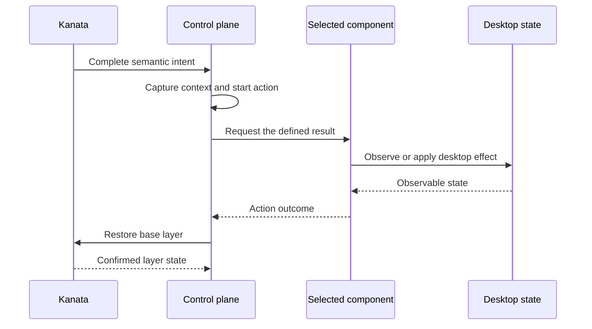

# Architecture

Desknav provides keyboard-first Windows desktop navigation. It keeps each
input path, state transition, and recovery action small enough to understand
and test without loading the whole desktop stack into memory.

This document defines the durable system shape. See [BACKLOG.md](BACKLOG.md)
for implementation work.

## Values

- **Immediacy:** Desktop navigation feels direct.
- **Comprehensibility:** Each path is understandable in isolation.
- **Predictability:** An action has one meaning and an explicit
  outcome.
- **Recoverability:** Handled failures return control without guessing whether
  an external action occurred; unexpected action-owner failure stops the
  application.

## Principles

### Continuous input takes a direct path

Continuous input reaches Windows without entering semantic-action routing.

### Semantic actions have one lifetime

A semantic action is a complete request for a desktop result, such as focusing
a window or acting on a selected target. It has one owner from acceptance
through outcome and keyboard restoration. A result can complete only the
action that requested it; a result arriving after that action ends cannot
complete a later action.

### External state is reconciled

Komorebi, UI Automation, Kanata, and the Windows desktop remain authoritative
for their observable state. Desknav reads that state after failures, restarts,
and contradictory events instead of extending an invalid in-memory
assumption.

### Policy is pure and effects stay at the boundary

State transitions and routing policy do not depend on Windows, UI Automation,
pipes, or process APIs. Adapters perform effects and report observations to
the policy that decides what they mean. Integration code uses native APIs
directly; an adapter exists only to isolate a process or operating-system
boundary from policy.

## Components

### Kanata

Kanata is the only keyboard hook. It owns keyboard layers, continuous pointer
movement, wheel input, and physical button taps. It emits complete semantic
intents to the control plane and reports layer changes used to confirm
keyboard restoration.

### Control plane

The control plane owns semantic intent interpretation, focus-context routing,
action lifetime, outcomes, and restoration. One local Akka.NET actor owns the
active semantic action so all events for that action are serialized through
one owner.

### Desknav UI

Desknav UI owns overlays, read-only target discovery, and explicitly requested
one-shot point or activation actions. It does not capture the keyboard or
choose how an intent is routed.

### Komorebi

Komorebi is an external window manager. Desknav requests defined window
effects and reconciles Komorebi's observable state.

### UI Automation

UI Automation is an external Windows interface for observing and acting on
accessible desktop elements. Desknav treats its tree and action results as
external observations.

## Interaction paths

### Continuous physical input

Physical movement, wheel, and button input flows from the keyboard through
Kanata to Windows. Its lifetime is the physical key state.

### Semantic actions

The control plane routes each action to the component that can deliver its
defined result: Desknav UI, Komorebi, or UI Automation.

An action that needs a visible choice pauses in Desknav UI until the user
selects or cancels. Each semantic action ends with an explicit outcome. If a
one-shot external action may have occurred but cannot be confirmed, its
outcome is unknown and Desknav does not retry it automatically.

## Failure and recovery

Expected timeouts, refusals, disconnects, and restarts of Kanata, Desknav UI,
or Komorebi are events handled by the control plane. They produce an explicit
outcome and recovery path.

A refusal is an explicit result that the selected component cannot perform
the requested action. It ends the action; the control plane does not
substitute a different result.

An unexpected failure of the actor that owns the active action stops the
application. Restarting that actor could replay an ambiguous one-shot action.

Keyboard restoration is reconciliation, not a write-only command. Desknav
returns ordinary keyboard control only after Kanata reports the requested
layer state. Repeating that request is safe because it asks for a state rather
than another logical action.

## Verification

Each property is tested at the lowest boundary that can observe it. Pure
behavior tests cover policy and state transitions. Kanata simulator tests run
the production keymap. Hardware input, live desktop state, UI Automation, and
visual overlays require acceptance testing in an isolated Windows VM because
simulators cannot prove those effects and the tests can take control of the
keyboard or pointer.
