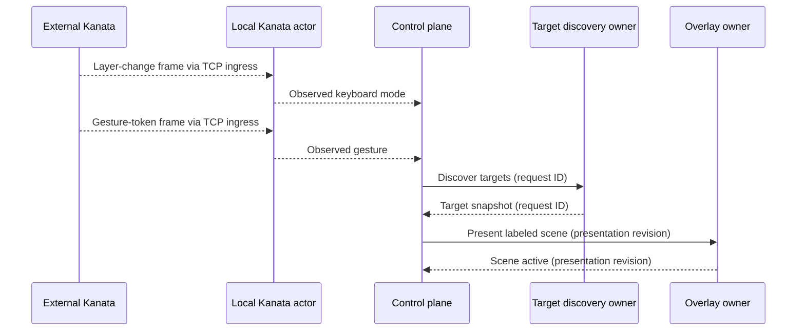

# Architecture

Desknav provides keyboard-first Windows desktop navigation. It keeps each
input path, state transition, and recovery action small enough to understand
and test without loading the whole desktop stack into memory.

This document defines the durable system shape. See [BACKLOG.md](BACKLOG.md)
for implementation work.

## Values

- **Immediacy:** Desktop navigation feels direct.
- **Comprehensibility:** Each path is understandable in isolation.
- **Predictability:** An action has one meaning and an explicit
  outcome.
- **Recoverability:** Handled failures return control without guessing whether
  an external action occurred; unexpected owner failure stops the
  application.

## Principles

### Direct physical input stays local

A physical gesture whose Windows effect is fully determined by the gesture
takes a direct path through Kanata. Held pointer movement, wheel input, and
physical button taps do not wait for control-plane routing.

### Gesture recognition and command meaning have separate owners

Kanata decides which physical gesture occurred, including tap, hold,
double-tap, chord, and layer behavior. While command input is delegated, it
forwards the recognized gesture to the control plane. The control plane
decides what that gesture means in the current navigation and desktop
context.

### Workflows and boundaries each have one owner

One local control-plane coordinator owns the logical navigation workflow. The
target-discovery, overlay, one-shot-action, keyboard-mode, and Komorebi
boundaries each have one owner.

When Kanata is in passthrough, control-plane and boundary work never delays
ordinary keyboard input. Unfinished work may delay only a later operation
that conflicts on the same boundary. A boundary owner may cancel, overlap,
queue, or fence its own work; it does not infer which workflow supersedes
another.

### Facts fan out and commands have one recipient

A committed state change may be published when several components
intentionally react to the same fact. A request to perform work is directed
to the one owner of that boundary. Publishing a fact does not transfer
workflow ownership to its subscribers.

### External state is reconciled

Komorebi, UI Automation, Kanata, and the Windows desktop remain authoritative
for their observable state. Desknav reads that state after failures, restarts,
and contradictory events instead of extending an invalid in-memory
assumption.

Desired state carries a newer-wins revision. Boundary owners serialize or
coalesce their effects and reconcile after completion so an older operation
cannot define the current state after a newer one. A newer user mode
supersedes an older keyboard-mode request.

### Outcomes describe knowledge, not permanent desktop truth

Target discovery and target positions are point-in-time observations. A
successful one-shot pointer result means the executor reported success for
the requested Windows effect; it does not mean the pointer or target remains
there afterward.

### Policy is pure and effects stay at the boundary

State transitions and routing policy do not depend on Windows, UI Automation,
pipes, or process APIs. Adapters perform effects and report observations to
the policy that decides what they mean. Integration code uses native APIs
directly; an adapter exists only to isolate a process or operating-system
boundary from policy.

### Artifact production and deployment have separate owners

Desknav owns deterministic artifact identity, exact contents, and
source-to-artifact verification. A deployment consumer owns provisioning,
version retention, process exclusion, activation, production cutover,
rollback between distinct artifacts, and acceptance for those guarantees.
Desknav does not prescribe or duplicate the consumer's deployment lifecycle.

## Components

### Kanata

Kanata is the only keyboard hook. It owns keyboard layers, continuous pointer
movement, wheel input, physical button taps, and physical gesture timing.
No other Desknav component acquires raw physical input or polls key, button, or
device state. The control plane accepts physical-gesture ingress only through
Kanata's newline-delimited JSON TCP protocol. Passthrough gestures produce no
control-plane-observable event. While input is delegated, stock Kanata reports
progressive layer changes and config-authored gesture tokens over its
newline-delimited JSON TCP protocol. Layer changes report observed keyboard
mode; gesture tokens report configuration-recognized input for coordinator
interpretation.

### Kanata TCP ingress

The TCP ingress owns the loopback socket and newline framing. It assigns a
connection lifetime and strictly increasing frame sequence to each frame read
from that socket. It does not interpret semantic meaning.

### Local Kanata actor

The local Kanata actor owns the keyboard-mode boundary. It accepts only the
current connection's increasing frames and emits layer and gesture
observations to the coordinator. It is the sole recipient of keyboard-mode
commands, but it does not activate label input while no capture-safe binding
exists. A capture-safe binding proves that each accepted label gesture was
captured while its exact presentation revision was the current confirmed
target map. A newer presentation, mode exit, or disconnect invalidates the
binding. The actor does not own observed-mode presentation.

### Control plane

The control plane owns focus-context routing, navigation workflow state,
outcomes, and desired external state. One local coordinator serializes
workflow decisions. It rejects obsolete input and results before they can
affect the current workflow.

The coordinator allocates a workflow generation whenever it starts a logical
navigation workflow. That coordinator-local identity scopes workflow state.
Boundary request and operation identities map results back to a workflow
generation but do not substitute for it.

### Desknav UI

Desknav UI hosts presentation and one-shot-action boundaries. Its overlay
owner atomically replaces older presentation with the current labeled scene.
Its one-shot-action owner serializes explicitly requested point, UIA
activation, or foreground coordinate-activation operations. Neither boundary
captures the keyboard or owns the navigation workflow.

### Komorebi

Komorebi is an external window manager. Desknav requests defined window
effects through one Komorebi owner. That owner serializes effects, observes
Komorebi state, and reconciles external state to the latest desired-state
revision accepted from the coordinator after completion, reconnect, and
restart. It reports observations and operation outcomes to the coordinator,
which alone decides their workflow meaning.

### UI Automation

UI Automation is an external Windows interface for observing and acting on
accessible desktop elements. The target-discovery owner schedules and cancels
read-only UIA work, reports snapshots with their request identity, and never
sends discovery results directly to presentation. Explicit UIA actions belong
to the one-shot-action owner and carry an operation identity.

## Interaction paths

### Continuous physical input

Physical movement, wheel, and button input flows from the keyboard through
Kanata to Windows. Its lifetime is the physical key state.

### Target-selection workflow

The coordinator directs boundary work from its current workflow state. The
diagram covers the capture-safe ingress-to-presentation portion.
[TCP ingress](#kanata-tcp-ingress) is transport plumbing and is omitted from
the lifelines.

Escape changes the coordinator state immediately and explicitly cancels
obsolete work. When a new request supersedes an old one, the coordinator sends
the cancellation before the new request without waiting for cancellation to
finish. Late results retain their request identity and cannot produce current
presentation or advance a later workflow.

The coordinator allocates and owns the presentation revision. After the
overlay owner confirms that revision is rendered, label activation follows the
[capture-safe input contract](#local-kanata-actor). A stale scene must never
select from a newer one.

Overlay, Komorebi, and other cleanup follow command-mode exit independently.
A later workflow may begin while old cleanup remains in flight; boundary
owners keep the newer desired state authoritative.

### Identity and ordering

Each protocol owns typed identities for its lifetime and ordering. Workflow
generations, request and operation identities, desired-state revisions, and
process and connection lifetimes are not interchangeable. Each logical state
has one writer, and each boundary rejects stale work using its protocol's
identities.

Cross-process messages identify the sender process lifetime, connection
lifetime, and a monotonic connection-local sequence when transport order
matters. A transport sequence restarts only with a new connection identity and
never identifies semantic work. Boundary owners reject prior-lifetime and
out-of-order messages before semantic identities are evaluated.

Stock Kanata does not provide a process lifetime or transport sequence. The
[Kanata TCP ingress](#kanata-tcp-ingress) supplies receive-side connection and
sequence identities. Those identities order received frames but cannot prove
that external Kanata emitted every notification. A disconnect invalidates the
observed mode; reconnect begins with unknown mode until external Kanata reports
its current layer.

## Failure and recovery

Boundary owners translate expected timeouts, refusals, disconnects, and
restarts of Kanata, Desknav UI, or Komorebi into observations and operation
outcomes. The coordinator handles their workflow meaning. Each expected
failure has an explicit outcome and recovery path.

A refusal, or a cancellation confirmed before dispatch, is known not to have
produced its requested effect. If a one-shot operation may have occurred but
its result is lost, its outcome is unknown.

Retry policy belongs to the operation. Read-only work and current desired
state may be repeated. A dispatched one-shot action whose outcome is unknown
is never redispatched. Reconciliation of current desired state is not a replay
of that action.

The one-shot-action owner fences ambiguous or still-running work before
accepting a conflicting operation. Its operation policy has a bounded recovery
path: establish a safe fence and dispatch the conflict, or explicitly refuse
it. Other boundary owners retain the latest desired-state revision accepted
from the coordinator and reconcile external state to that replica after
completion, cancellation, reconnect, and restart. They do not author desired
state.

An unexpected failure of the coordinator or a boundary owner stops the
application. Restarting must reconcile observable state and must not replay
an ambiguous one-shot operation.

## Verification

Verification exercises message ordering and the observable desktop result at
the lowest boundary that can prove each contract.

Ordinary-key passthrough acceptance holds conflicting boundary work unfinished
and requires delivery within the VM latency bound established by direct
Kanata-to-Windows passthrough. Artifact inspection proves ordinary passthrough
mappings do not route through the control plane, and VM acceptance proves
delivery while control-plane IPC is unavailable.

Hardware input, live desktop state, UI Automation, and visual overlays require
acceptance testing in an isolated Windows VM because simulators cannot prove
those effects and the tests can take control of the keyboard or pointer.
